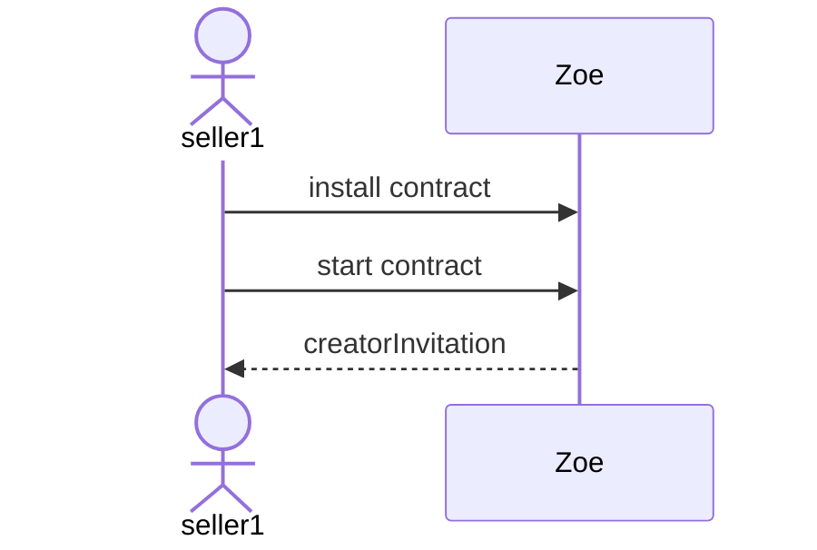
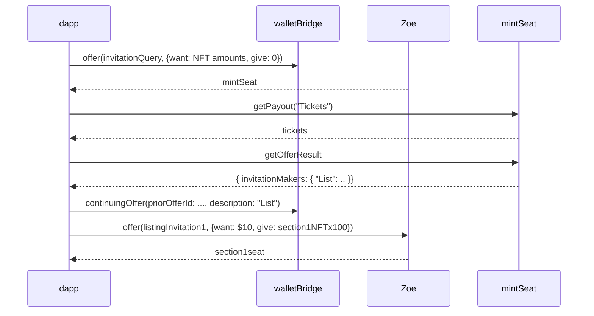
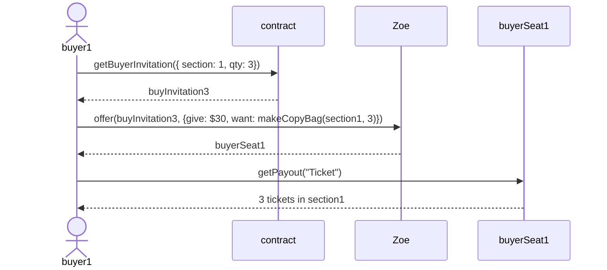

context: https://github.com/Agoric/agoric-sdk/issues/4657

Story: seller1 is a venue with tickets in section1, section2, ...
the price for all tickets in section1 is the same but
maybe different from the price in section2.

Deploy script:




Buyer buys ticket:



## Semi-fungible tokens

We're familiar with: `AmountMath.make(simoleans, 10)`

If you have 100 seats in section1 that you consider equivalent, you can do:

`AmountMath.make(seatBrand, makeCopyBag("section1", 100))`

Some code suggests that a `harden()` is needed:

`AmountMath.make(seatBrand, harden(makeCopyBag("section1", 100)))`

[test-attestation](https://github.com/Agoric/agoric-sdk/blob/master/packages/run-protocol/test/attestation/test-attestation.js#L102) has some examples.

## Continuing Invitation Pattern

contract part: offer result includes:

```js
    invitationMakers: Far('invitation makers', {
      AdjustBalances: vault.makeAdjustBalancesInvitation,
      CloseVault: vault.makeCloseInvitation,
      TransferVault: vault.makeTransferInvitation,
    }),
```

https://github.com/Agoric/agoric-sdk/blob/master/packages/run-protocol/src/vaultFactory/vaultKit.js

dapp part: to act on the result of a previous offer:

```js
    continuingInvitation: {
      priorOfferId: vaultToManageId,
      description: 'AdjustBalances',
    },
```

https://github.com/Agoric/dapp-treasury/blob/main/ui/src/components/vault/VaultManagement/makeAdjustVaultOffer.js

an example of a dapp using an `invitationQuery`:
https://github.com/Agoric/agoric-sdk/blob/104fbfe120990cd9d1f81c436aa176017e7df7f8/packages/wallet/api/test/test-lib-wallet.js#L1148-L1173
